  

## 📌 About Me
- Hi, I'm Jatin Chandolia 👋
- 🎓 AI Student at NIAT Jaipur
- 🤖 Passionate about Artificial Intelligence, Machine Learning, and Generative AI
- 💻 Skilled in Python and continuously learning new technologies
- 🚀 Building projects, exploring AI research, and contributing to open-source
- 📚 Always curious about solving real-world problems with technology
- "Learning, Building, and Growing Every Day."

## 🧠 My Focus Areas
- Artificial Intelligence
- Machine Learning
- Generative AI
- Python Programming
- Data Structures & Algorithms
- Open Source Contribution
- Research & Innovation
- Problem Solving

## 📊 GitHub Stats & Trophies

  
  

  

  

  

## 🛠️ Languages & Tools

<h3 align="center">Programming Languages</h3>

  &nbsp;&nbsp;
  &nbsp;&nbsp;
  

<h3 align="center">Frontend</h3>

  

<h3 align="center">Database</h3>

  &nbsp;&nbsp;
  

<h3 align="center">Tools</h3>

  

  

 

## 🔗 Connect with Me

  &nbsp;&nbsp;
  

  

